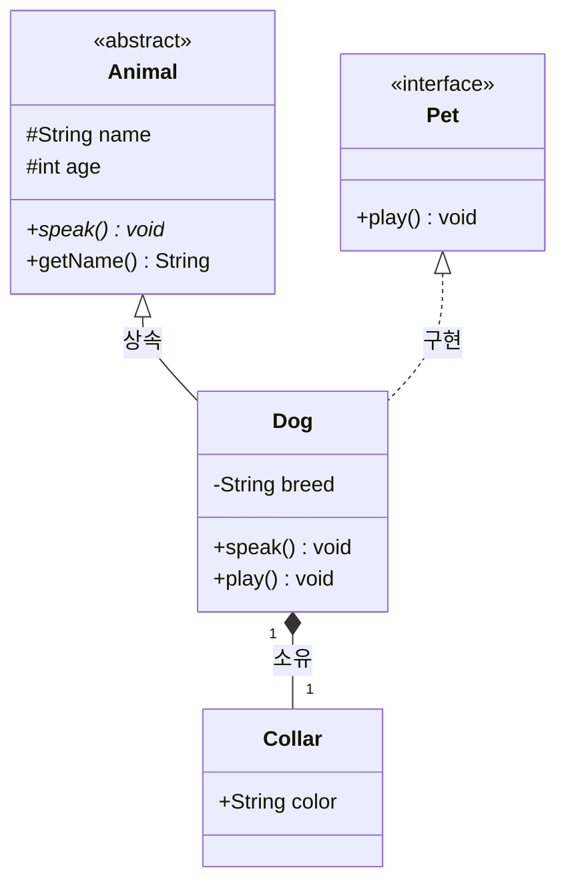

---
aliases:
  - 클래스 다이어그램
  - Class Diagram(클래스 다이어그램)
  - classDiagram
---

- [[클래스]] 멤버(속성 · 메서드)와 클래스 간 ==정적 관계== 표현하는 [[UML]] [[다이어그램]]
- 선언 키워드 `classDiagram`

### 형태
- 멤버 정의 두 방식
	- 블록 방식 : `class Dog { +String name }`
	- 콜론 방식 : `Dog : +String name`
- 접근 제어자 기호
	- `+` public / `-` private / `#` protected / `~` package
	- [[메소드]] 뒤 `*` abstract, `$` static
	- 반환 타입은 괄호 뒤 표기 -> `+speak() void`
- 스테레오타입 : `<<interface>>`, `<<abstract>>`, `<<enumeration>>`
- 다중도(multiplicity) : 관계 양 끝에 따옴표 표기
	- ==ex)== `Order "1" --> "*" Item`

### 종류
| 문법 | 관계 | 의미 |
| --- | --- | --- |
| `<\|--` | Inheritance | [[상속]] (is-a) |
| `*--` | Composition | 강한 소유, 생명주기 공유 |
| `o--` | Aggregation | 약한 소유 |
| `-->` | Association | 단순 참조 |
| `..>` | Dependency | 일시적 의존 |
| `..\|>` | Realization | [[인터페이스]] 구현 |

### 예시

### 활용
- [[객체 지향]] 설계 과제의 상속 구조 · 인터페이스 분리 검증
- [[디자인 패턴]] 학습 노트에 구조 기록
- 레거시 코드 온보딩 시 핵심 도메인 모델 관계도 파악
- 리팩터링 PR 에서 클래스 책임 분리 전/후 비교

### 참고
- https://mermaid.js.org/syntax/classDiagram.html
