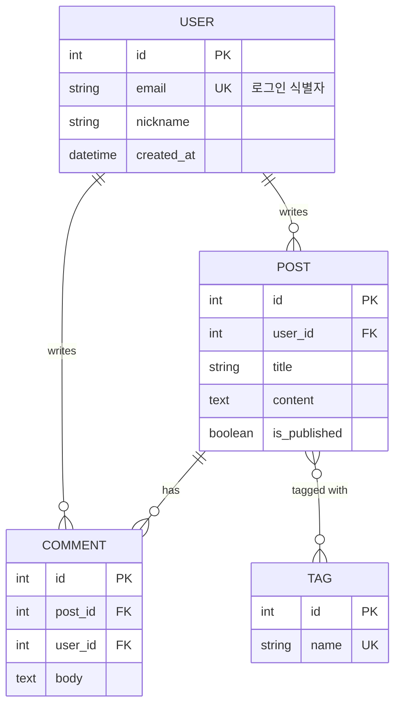

---
aliases:
  - 개체-관계 다이어그램
  - ER Diagram(개체-관계 다이어그램)
  - erDiagram
---

- [[데이터베이스]] 엔티티(테이블)와 그 사이 관계 표현
- 선언 키워드 `erDiagram`

### 형태
- 관계 문법 : `ENTITY1 [좌측 카디널리티]--[우측 카디널리티] ENTITY2 : 라벨`
	- 라벨(`:` 뒤 동사구)은 ==필수==, 생략 시 렌더링 [[Error|오류]]
- 선 종류로 식별 관계 구분
	- `--` 실선 : identifying
	- `..` 점선 : non-identifying
- 엔티티 속성 : 중괄호 블록에 `타입 이름 키 "주석"` 순서
	- 키 종류 `PK` · `FK` · `UK`, 콤마로 복수 지정 O

### 종류
- 카디널리티 기호 (까마귀발 표기법)

| 기호 | 의미 |
| --- | --- |
| `\|o` / `o\|` | 0 또는 1 |
| `\|\|` | 정확히 1 |
| `}o` / `o{` | 0 또는 다수 |
| `}\|` / `\|{` | 1 이상 다수 |

### 예시

### 활용
- [[관계형 데이터베이스]] 설계 과제의 정규화 결과 제출 전 관계 검증
- 마이그레이션 PR 에 [[스키마]] 변경(테이블 추가, FK 관계 변경) 첨부
- ORM(Prisma, TypeORM) 모델 정의 전 도메인 구조 합의
- N:M 관계에서 중간 테이블 필요 지점 설명

### 참고
- https://mermaid.js.org/syntax/entityRelationshipDiagram.html
