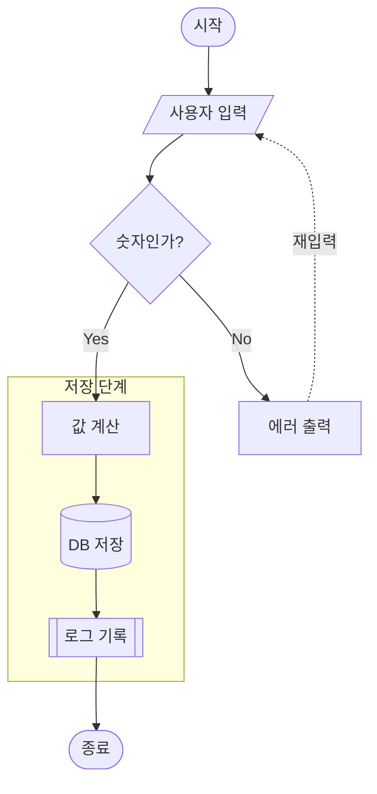

---
aliases:
  - 플로우차트
  - 순서도
  - Flowchart(플로우차트)
---

- 처리 흐름과 분기를 [[뉴런|노드]]-엣지로 표현하는 가장 기본적인 [[다이어그램]]
- 선언 키워드 `flowchart`
	- 구버전 `graph` 도 동작 O, 신규 문법은 `flowchart` 권장

### 형태
- 방향 지시자
	- `TD` / `TB` : 위 → 아래
	- `LR` : 왼 → 오
	- `BT` / `RL` : 역방향
- 노드 = ID + 모양 괄호 + 라벨
	- ==ex)== `A[처리]`, `C{조건}`
	- 같은 ID [[재사용(Reuse)|재사용]] -> 동일 노드 취급, 라벨은 최초 1회만 작성
- `subgraph` : 논리적 그룹 묶기 -> 계층 구조 표현 O

### 종류
- 엣지
	- `-->` : 실선 화살표
	- `---` : 실선, 화살촉 X
	- `-.->` : 점선
	- `==>` : 굵은 선
- 엣지 라벨 : `A -->|Yes| B` 또는 `A -- Yes --> B`

### 노드 모양
| 문법 | 모양 | 주 용도 |
| --- | --- | --- |
| `A[텍스트]` | 사각형 | 일반 처리 |
| `A(텍스트)` | 둥근 사각형 | 부드러운 처리 |
| `A([텍스트])` | 스타디움 | 시작 · 종료 |
| `A{텍스트}` | 마름모 | 조건 분기 |
| `A[/텍스트/]` | 평행사변형 | 입력 · 출력 |
| `A[(텍스트)]` | 원통 | [[데이터베이스]] |
| `A[[텍스트]]` | 이중 사각형 | 서브루틴 |
| `A((텍스트))` | 원 | 연결점 |

### 예시

### 활용
- [[알고리즘 문제]] 풀이의 조건 분기 · 반복 구조 정리
- 로그인 · 결제처럼 예외 경로 많은 비즈니스 로직 문서화
- [[CI]] · [[CD]] 파이프라인 단계와 실패 시 롤백 경로 README 표기
- 리팩터링 전/후 제어 흐름 차이 시각 비교

### 참고
- https://mermaid.js.org/syntax/flowchart.html
