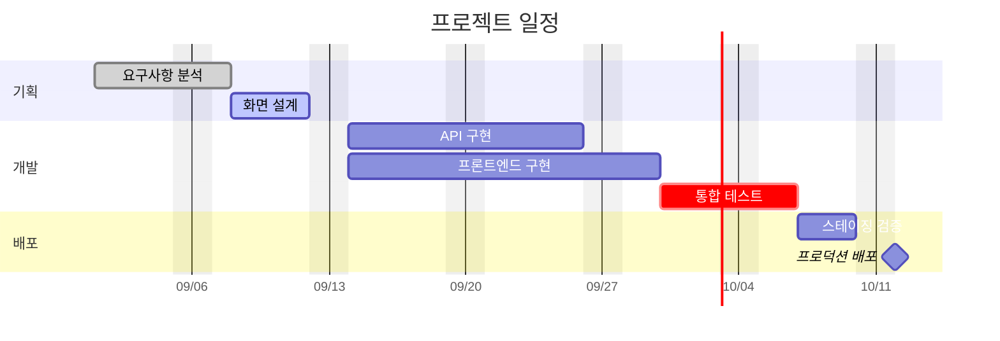

---
aliases:
  - 간트 차트
  - Gantt Chart(간트 차트)
---

- 작업(task)의 ==기간과 선후 의존 관계== 가로 막대로 표현하는 일정 관리 [[다이어그램]]
- 선언 키워드 `gantt`

### 형태
- 헤더 설정
	- `dateFormat` : 입력 날짜 형식, ==ex)== `YYYY-MM-DD`
	- `axisFormat` : 화면 표시 축 형식, ==ex)== `%m/%d`
	- `excludes weekends` : 주말 기간 계산 제외
- 작업 문법 : `작업명 :태그, ID, 시작일, 기간`
	- 시작일 대신 `after 다른작업ID` -> 의존 관계 지정 O
- `section` 으로 작업 그룹핑

### 종류
- [[state|상태]] 태그
	- `done` : 완료
	- `active` : 진행 중
	- `crit` : [[크리티컬 패스]]
	- `milestone` : 0일 지점

### 예시

### 활용
- 팀 프로젝트 계획서에 마일스톤 · 데드라인 명시
- 병렬 · 순차 작업 섞인 일정에서 [[크리티컬 패스]] 도출
- [[스프린트]] 회고에서 계획 대비 실제 소요 기간 비교
- 졸업 프로젝트 중간 발표 자료 진척도 시각화

### 참고
- https://mermaid.js.org/syntax/gantt.html
