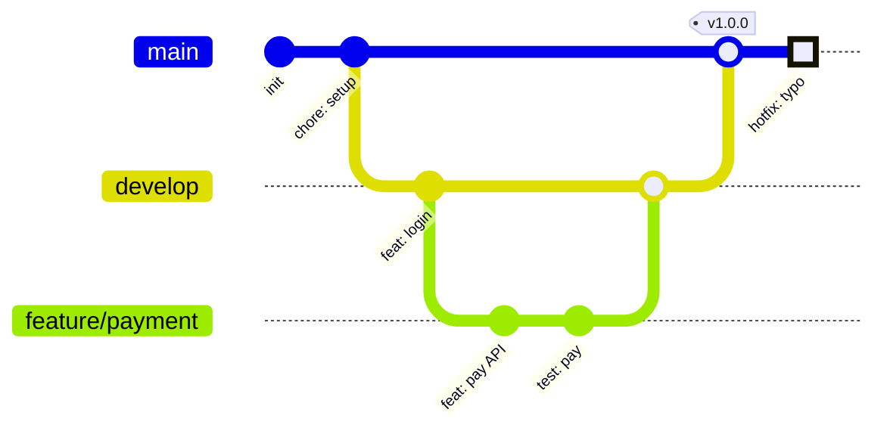

---
aliases:
  - 깃 그래프
  - Git Graph(깃 그래프)
  - gitGraph
---

- [[Git]] 의 ==커밋 히스토리와 브랜치 분기 · 병합== 시각화
- 선언 키워드 `gitGraph`
- 기본 브랜치명 `main` -> 다른 [[이름]] 사용 시 config 지시자 필요

### 기능
| 명령어 | 내용 |
| --- | --- |
| `commit` | 현재 브랜치에 커밋 추가, `id:` · `tag:` · `type:` 옵션 |
| `branch 이름` | 새 브랜치 생성, 이동은 X |
| `checkout 이름` / `switch` | 브랜치 전환 |
| `merge 이름` | 현재 브랜치로 병합 |
| `cherry-pick id: "..."` | 특정 커밋만 가져오기 |

### 종류
- 커밋 타입
	- `NORMAL` : 기본
	- `REVERSE` : 되돌림
	- `HIGHLIGHT` : 강조

### 예시

### 활용
- Git Flow · GitHub Flow 등 브랜치 [[Strategy|전략]] 팀 설명
- 기여 가이드(CONTRIBUTING.md)에 PR 흐름 명시
- rebase 와 merge 의 히스토리 차이 비교 정리
- 릴리스 태그 · 핫픽스 반영 지점 문서화

### 참고
- https://mermaid.js.org/syntax/gitgraph.html
