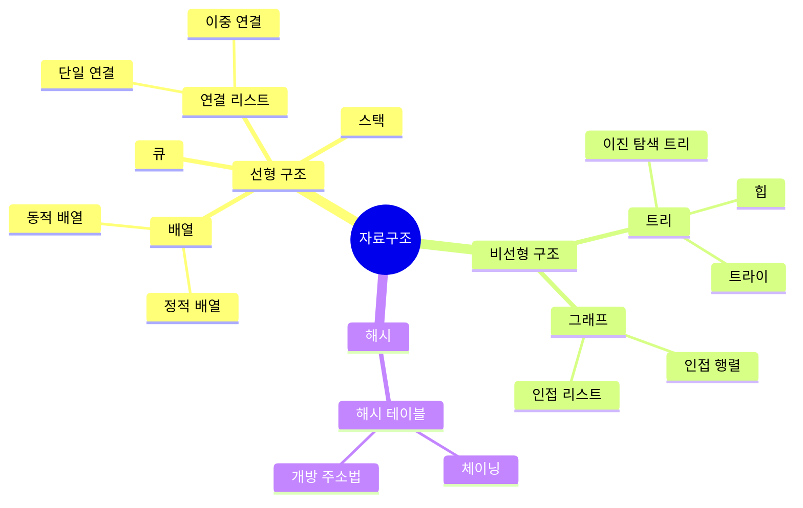

---
aliases:
  - 마인드맵
  - Mindmap(마인드맵)
---

- 하나의 루트에서 뻗어나가는 ==개념 계층 구조== 표현
- 선언 키워드 `mindmap`
- 다른 유형과 달리 화살표 X -> ==들여쓰기 깊이가 곧 계층==
	- 들여쓰기가 문법의 핵심 -> 공백 단위 일관 유지 필수

### 형태
- [[뉴런|노드]] 모양은 [[Flowchart]] 와 유사한 괄호 지정
	- `id[사각형]`, `id(둥근)`, `id((원))`, `id))구름((`, `id{{육각형}}`
- `::icon(fa fa-book)` : 아이콘 지정
- `:::className` : [[클래스]] 지정

### 예시

### 활용
- 시험 대비로 한 과목 개념 지도 한 장 정리
- 신규 기능 브레인스토밍 결과 카테고리별 묶기
- 기술 면접 준비에서 주제별 하위 키워드 점검

### 참고
- https://mermaid.js.org/syntax/mindmap.html
