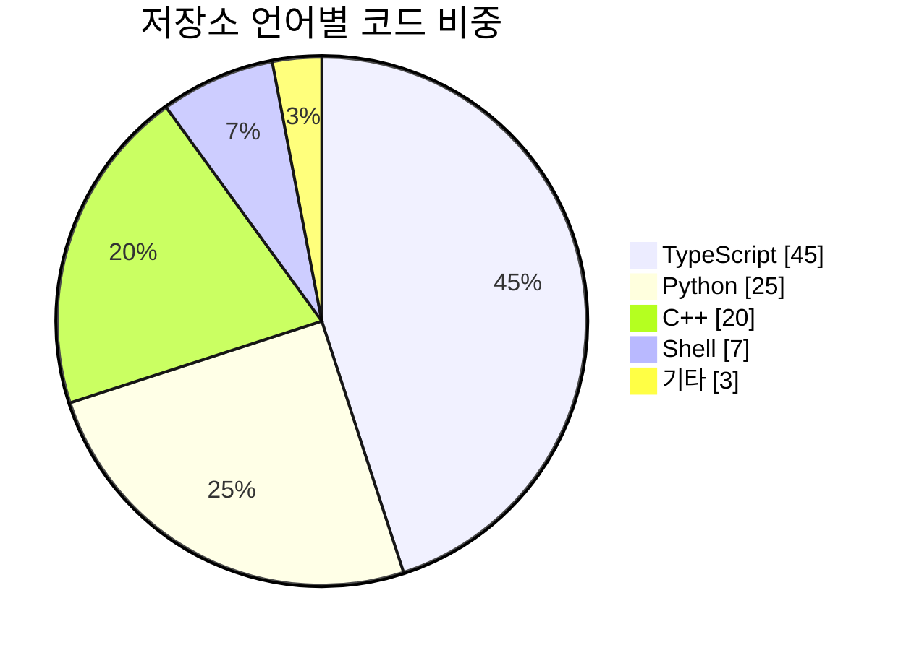

---
aliases:
  - 파이 차트
  - 원형 차트
  - Pie Chart(파이 차트)
---

- 전체 대비 각 항목의 ==비율== 원형으로 표현하는 가장 단순한 차트
- 선언 키워드 `pie`

### 형태
- `"라벨" : 값` 한 줄에 하나씩
	- 값은 절대 수치, 백분율 계산은 [[Mermaid]] 자동 처리
- `pie showData` -> 라벨 옆에 원본 수치 함께 표시

### 조건
- 항목 ==6개== 초과 -> [[Readability|가독성]] 급락, "기타" 로 묶기 권장

### 예시

### 활용
- 프로젝트 기술 [[stack|스택]] 구성 비율 README 요약
- 테스트 커버리지 · 버그 유형 분포 등 한 시점 구성비 표시
- 설문 결과 · 사용자 통계 발표 자료 첨부

### 참고
- https://mermaid.js.org/syntax/pie.html
