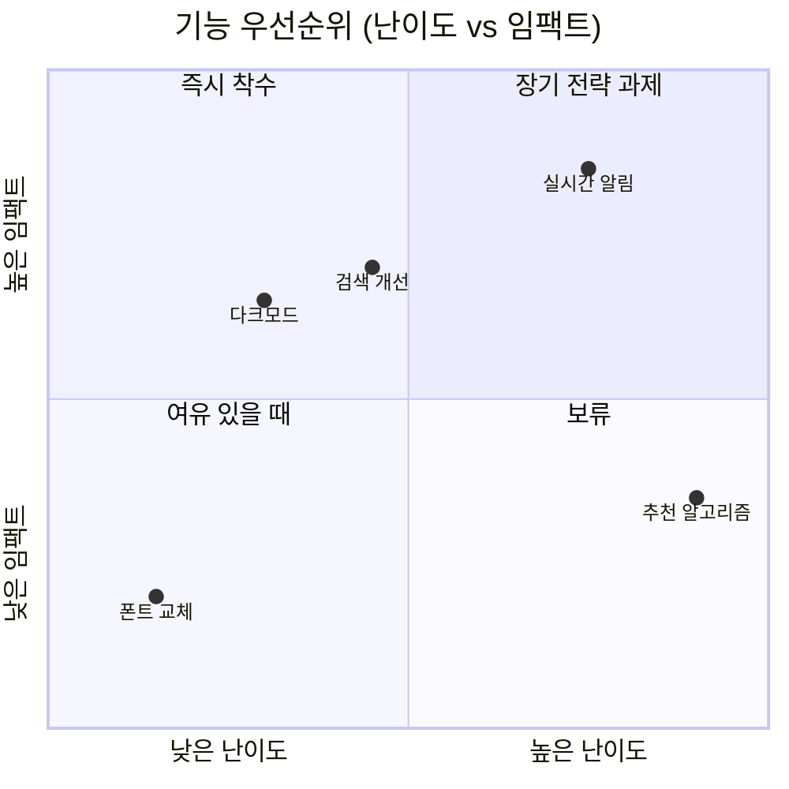

---
aliases:
  - 사분면 차트
  - Quadrant Chart(사분면 차트)
  - quadrantChart
---

- 두 축으로 나뉜 ==4분면에 항목 [[배치 처리|배치]]== -> 우선순위 판단하는 차트
- 선언 키워드 `quadrantChart`

### 형태
- 축 정의
	- `x-axis 왼쪽라벨 --> 오른쪽라벨`
	- `y-axis 아래라벨 --> 위라벨`
- [[데이터]] 포인트 : `항목명: [x, y]`
	- 좌표는 ==0~1 사이== 값만 허용

### 구조
- 사분면 번호는 ==오른쪽 위부터 반시계 방향==

| 번호 | 위치 |
| --- | --- |
| `quadrant-1` | 우상단 |
| `quadrant-2` | 좌상단 |
| `quadrant-3` | 좌하단 |
| `quadrant-4` | 우하단 |

### 예시

### 활용
- 백로그 그루밍에서 기능 우선순위 팀 합의
- 리스크 관리에서 발생 확률 × 영향도로 대응 순서 결정
- 기술 부채 목록을 "고치기 쉬움 vs 위험도" 로 분류

### 참고
- https://mermaid.js.org/syntax/quadrantChart.html
