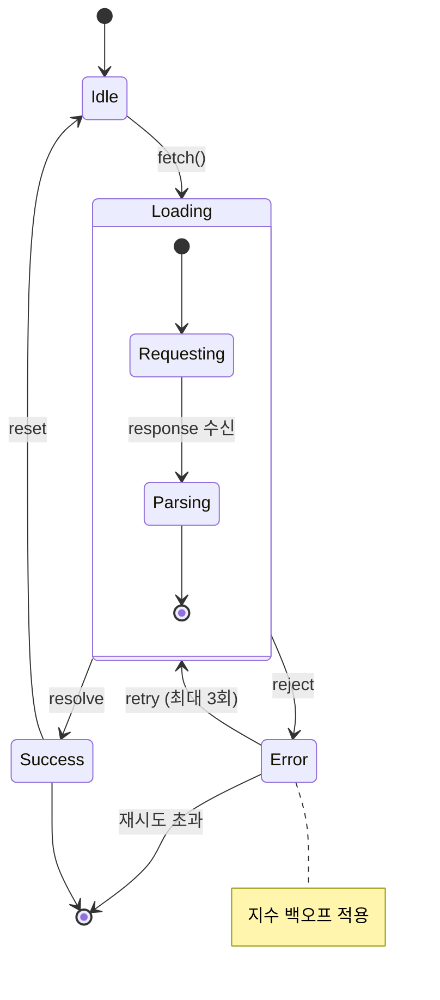

---
aliases:
  - 상태 다이어그램
  - State Diagram(상태 다이어그램)
  - stateDiagram-v2
---

- [[객체]]가 가질 수 있는 ==[[state|상태]](state)== 와 [[Event|이벤트]]에 의한 ==전이(transition)== 표현
- 선언 키워드 `stateDiagram-v2`
	- v1 은 레거시, 신규 작성은 v2
- [[Flowchart]] 와 차이 : [[뉴런|노드]]가 "처리" X -> "머무는 상태" O

### 형태
- `[*]` : 시작점이자 종료점, 위치에 따라 의미 상이
	- `[*] --> Idle` : 초기 상태
	- `Done --> [*]` : 최종 상태
- 전이 라벨은 콜론으로 -> `Loading --> Success : resolve`

### 종류
- 복합 상태 : `state Parent { ... }` 로 중첩
- 분기 : `state cond <<choice>>` 로 조건 분기점 생성
- 병렬 상태 : 복합 상태 내부에서 `--` 로 영역 구분
- 노트 : `note right of State : 설명`

### 예시

### 활용
- [[Promise]] 의 `pending → fulfilled / rejected` 같은 [[비동기]] 상태 흐름 정리
- [[React]] `useReducer` 액션별 상태 전이 설계 단계 검증
- 주문 · 배송 · 결제처럼 되돌릴 수 없는 상태 머신 명세
- [[운영체제]] 프로세스 상태(Ready, Running, Waiting, Terminated) 학습 노트

### 참고
- https://mermaid.js.org/syntax/stateDiagram.html
