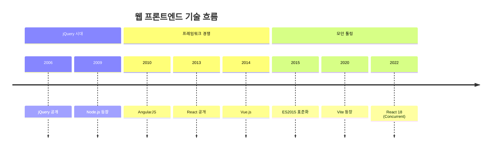

---
aliases:
  - 타임라인
  - Timeline(타임라인)
---

- 사건을 ==시간 순서대로 나열== 하는 [[다이어그램]]
- 선언 키워드 `timeline`
- [[Gantt Chart]] 와 차이 : 기간 X -> ==시점== 중심

### 형태
- `시점 : 사건`
	- 같은 시점에 여러 사건 -> 콜론으로 이어 붙이거나 다음 줄에 `: 사건` 추가
- `section` 으로 시대 · 단계 묶기 -> 색상 구분

### 예시

### 활용
- 기술의 역사 · 버전 변천사 학습 노트 정리
- 프로젝트 회고에서 주요 의사결정 시점 나열
- 장애 사후 분석(Postmortem)에 사건 발생 순서 기록

### 참고
- https://mermaid.js.org/syntax/timeline.html
