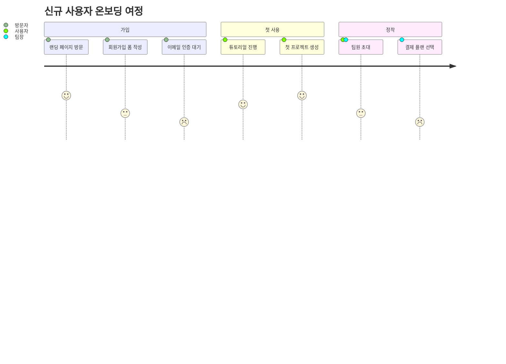

---
aliases:
  - 사용자 여정
  - User Journey(사용자 여정)
  - journey
---

- 사용자가 서비스 이용하며 겪는 단계와 ==각 단계의 만족도== 함께 표현
- 선언 키워드 `journey`

### 형태
- `작업명: 점수: 행위자1, 행위자2`
	- 점수 ==1~5==, 낮을수록 불만족 -> 낮은 구간이 개선 포인트
	- 행위자는 콤마로 여러 명 지정 O
- `section` 으로 여정의 큰 단계 구분

### 예시

### 활용
- [[UX]] 개선 과제에서 이탈 발생 지점 팀 공유
- 기획 문서에 사용자 시나리오 정량 첨부
- 기존 플로우와 개선 플로우의 만족도 변화 비교

### 참고
- https://mermaid.js.org/syntax/userJourney.html
