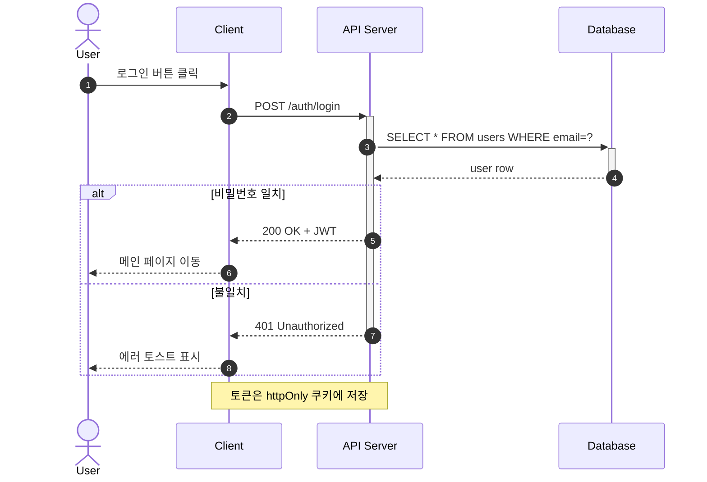

---
aliases:
  - Sequence Diagram
  - 순차 다이어그램(Sequence Diagram)
  - sequenceDiagram
---

- [[시스템]] · [[객체]] 상호작용 과정 그림으로 표현

| 요소                 | 설명                     |
| ------------------ | ---------------------- |
| [[액터]] (Actor)     | 시스템에서 서비스 요청 외부 요소     |
| [[객체]] (Object)    | [[메세지]] 주고받는 주체            |
| 생명선 (Lifeline)     | 객체가 [[메모리]] 존재하는 기간        |
| 실행 상자 (Active Box) | 객체가 메세지 주고 받으며 구동되고 있음 |
| 메세지 (Message)      | 객체가 상호작용 위해 주고 받는 메세지  |
| 회귀 메세지 (Reply)     | 객체가 처리한 반환값 담긴 메세지     |
| 제어 블록 ([[반복문\|Loop]])       | 반복 처리되는 영역             |

### Mermaid 표기
- [[Mermaid 작성 규칙]] 상의 선언 키워드 `sequenceDiagram`
- 참여자 간 메세지가 오가는 ==시간 순서== 를 세로축으로 표현
	- [[Flowchart]] 는 "무엇을 하는가" -> Sequence 는 "누가 누구에게 언제"
- `participant` · `actor` 로 등장 순서 명시 고정
	- 생략 시 첫 등장 순
	- `participant S as Server` 별칭 -> 코드 단축
- 화살표 문법
	- `->>` 실선 + 화살촉 : [[동기]] 요청
	- `-->>` 점선 + 화살촉 : 응답(return)
	- `-)` : [[비동기]] 메세지
	- `-x` : 실패 · 소멸
- `activate` / `deactivate` (축약 `+`, `-`) : 활성 구간(lifeline bar) 표시
- 제어 블록 : `alt` 분기, `opt` 선택, `loop` 반복, `par` 병렬
- `autonumber` 선언 -> 메세지 순번 자동 부여

### 활용
- REST [[API]] 설계 리뷰에서 [[클라이언트]] · [[서버]] · [[데이터베이스]] 간 호출 순서 합의
- OAuth · 결제 승인처럼 3자 이상 얽힌 인증 플로우 설명
- 비동기 처리(메시지 큐, 웹소켓)의 요청 · 응답 타이밍 차이 표시
- 버그 리포트에 "정상 흐름 vs 실제 발생 흐름" 병렬 첨부

### 참고
- https://mermaid.js.org/syntax/sequenceDiagram.html
